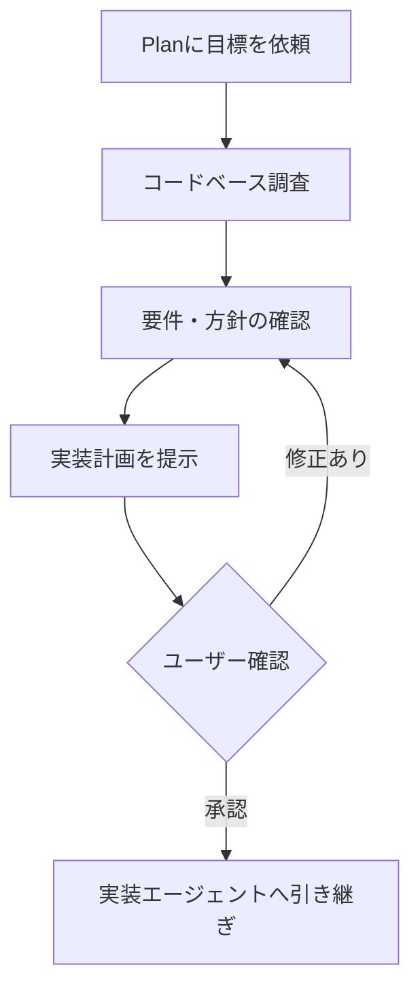

User:
ChatGPT本プロジェクト内に Copilot-Default-Plan.agent.md を追加しました。 このPlanエージェントを大まかに説明してください。 また、このPlanエージェントの具体的な使用ケースはどのようなものがあるか、どのようなときに使用した方が効果的か、も検討して、教えてください。

ChatGPT:
[Copilot-Default-Plan.agent.md](sandbox:/workspace/scratch/c7179d7d4c42/project_sources/04-Copilot-Default-Plan.agent.md) は、実装前の調査・要件整理・実装計画作成に特化した、読み取り中心のエージェントです。

## 大まかな役割

この Plan エージェントは、単に「作業手順を箇条書きにする」ものではありません。

次の流れで、実際に別のエージェントが実装できるレベルまで計画を具体化します。

1. ワークスペースを調査する
2. 類似実装、既存の設計パターン、影響範囲を確認する
3. 不明点をユーザーに質問する
4. 実装方針と対象範囲を決める
5. 変更対象ファイル、依存関係、検証方法を含む計画を作成する
6. ユーザーのレビューを受けて計画を修正する
7. 承認後、別エージェントへ実装を引き継ぐ

重要なのは、Plan 自身は実装しないという点です。ファイル編集は禁止されており、計画作成だけが責務になっています。

## 4つの作業フェーズ

### 1. Discovery（調査）

最初に `Explore` サブエージェントを利用して、次のような情報を調べます。

* 関連するファイルや機能
* 既存の類似実装
* 再利用すべき関数、型、設計パターン
* 変更の影響範囲
* 技術上の制約
* 実装前に解決すべき曖昧な点

フロントエンド、バックエンド、データベースなど、独立して調査できる領域が複数ある場合は、2～3個の `Explore` を並行実行する方針です。

### 2. Alignment（認識合わせ）

調査によって不明点や複数の選択肢が見つかった場合、`askQuestions` を使用してユーザーに確認します。

例えば、次のような内容です。

* 既存仕様を維持するか変更するか
* 後方互換性が必要か
* どこまでを今回の対応範囲に含めるか
* 複数の実装方式のどれを採用するか

回答によって前提が変われば、再び調査へ戻ります。

### 3. Design（計画作成）

調査と認識合わせが完了したら、以下を含む実装計画を作成します。

* 実装手順
* 手順間の依存関係
* 並行実行できる作業
* 変更または参照するファイルのフルパス
* 再利用する具体的な関数や型
* 自動テストと手動確認
* 対応範囲と対象外
* 話し合いで決定した内容
* 残っている検討事項

計画は `/memories/session/plan.md` に保存されますが、それとは別に、ユーザーにも読みやすい形で表示するよう指定されています。

### 4. Refinement（計画の修正）

提示された計画に対してユーザーが変更を依頼した場合、Plan は計画ファイルと表示内容の両方を更新します。

明示的に承認されるまで、調査・質問・修正を繰り返す設計です。

## Ask エージェントとの違い

| 観点        | Ask                | Plan                                   |
| --------- | ------------------ | -------------------------------------- |
| 主な目的      | 質問への回答、コードの説明、原因調査 | 実装前の調査と実行可能な計画作成                       |
| 成果物       | 説明、回答、改善案          | 具体的な実装計画                               |
| ファイル編集    | しない                | しない                                    |
| ワークスペース調査 | 質問への回答に必要な範囲       | 変更対象と影響範囲を体系的に調査                       |
| ユーザーへの質問  | 質問自体が曖昧な場合         | 要件・設計判断・対象範囲の確定に積極的に使用                 |
| サブエージェント  | 使用しない              | `Explore` を使用可能                        |
| 実装への移行    | 基本的に案内のみ           | `Start Implementation` で実装エージェントへ引き継げる |
| 計画の永続化    | 必須ではない             | `/memories/session/plan.md` に保存        |

端的に表すと、次の違いです。

* Ask：「このコードはどうなっているか」「なぜエラーになるか」を知りたい
* Plan：「この機能を安全に追加するには、どこをどう変更すべきか」を決めたい

以前作成した Deep-Ask は、詳細な調査と回答が目的です。一方、この Plan は調査結果を実装計画に変換し、実装担当へ引き渡すところまでを目的としています。

## 具体的な使用ケース

### 1. 複数ファイルにまたがる機能追加

例：

> このシステムにユーザー権限管理機能を追加したい。実装計画を作成してください。

Plan は、画面、API、データベース、認証処理、テストを調査し、変更順序や依存関係を整理できます。

### 2. 既存機能の大規模な仕様変更

例：

> 現在のファイル保存方式を、ローカル保存からクラウドストレージへ変更したい。

保存処理だけでなく、設定、例外処理、既存データ、テスト、移行方法なども影響するため、Plan が効果的です。

### 3. リファクタリング

例：

> 肥大化したサービスクラスを分割したい。既存機能を壊さない計画を作成してください。

既存の呼び出し関係やテストを調査し、段階的に分割する計画を立てられます。

### 4. ライブラリやフレームワークの移行

例：

> 古い認証ライブラリを新しい方式へ移行したい。

利用箇所、設定、互換性、段階的移行、検証方法を先に整理することで、実装時の手戻りを減らせます。

### 5. 原因は判明しているが、修正範囲が広い不具合

例：

> 日付処理の仕様不統一が複数機能にあります。統一するための修正計画を作成してください。

単一のエラー原因を調べるだけなら Ask／Deep-Ask が適していますが、複数箇所を安全に修正する順序まで必要なら Plan が適しています。

### 6. ドキュメント同期・整合性修正

現在の学習用サーバープロジェクトであれば、次のような依頼が該当します。

> OS構成の変更を、基本設計書、詳細設計書、構築手順書、運用設計書へ反映する計画を作成してください。

Plan では、各文書の依存関係、修正順序、反映対象、対象外とする試行錯誤、文書間の整合確認方法を整理できます。

### 7. カスタムエージェント群の再設計

今回のプロジェクトに近い例では、次のような依頼です。

> Lite-Ask、Deep-Ask、Lite-Edit、Planの責務が重複しないよう、構成を見直す計画を作成してください。

各エージェントの定義を調査し、責務、利用ツール、切り替え基準、修正対象ファイルを計画化できます。

## 使用すると特に効果的な場面

次の条件が複数当てはまる場合に効果的です。

* 変更対象が複数ファイルにまたがる
* 既存実装を詳しく調査してから方針を決めたい
* 要件に曖昧な部分がある
* 複数の実装方式が考えられる
* 変更順序や依存関係が重要
* 既存機能を壊すリスクがある
* 自動テストと手動確認の両方を計画したい
* 実装担当者に、そのまま渡せる計画が必要
* 大規模な作業を始める前に、対応範囲を確認したい

特に「調べてから実装してほしいが、いきなりファイルを変更されるのは避けたい」という場合に向いています。

## 使用しなくてもよい場面

次のような作業では、Plan は少し大げさです。

* 1行だけ修正する
* 明確な文字列置換や整形
* 単一ファイルの軽微な変更
* コードの意味を知りたいだけ
* エラー原因について説明してほしいだけ
* 実装内容と対象箇所がすでに完全に決まっている
* すぐに編集まで実行してほしい

この場合は、次の使い分けが適切です。

* 簡単な質問・調査：Lite-Ask
* 詳細な調査・説明：Deep-Ask
* 軽微な修正：Lite-Edit
* 複雑な実装前の設計：Plan
* 計画承認後の実装：Edit／Agent

## このPlanエージェントの特徴的な点

このエージェントは「計画書を作るだけの軽量エージェント」ではなく、調査担当と実装担当の間に位置する、かなり本格的な設計・計画エージェントです。

また、以下の2つのハンドオフが用意されています。

* `Start Implementation`
  承認した計画を、実装可能な通常エージェントへ引き継ぐ

* `Open in Editor`
  計画を未保存の `.prompt.md` ファイルとしてエディターに開き、さらに編集できるようにする

したがって、基本的な運用は次のようになります。



今回作成しているカスタムエージェント構成では、Plan は Lite／Deep の違いというより、Ask・Editとは別軸の役割として、そのまま独立させるのがよいと思います。特に大規模調査後に実装へ進む案件では、`Deep-Ask → 手作業で計画作成` とするよりも、最初から Plan を選ぶ方が作業目的に合っています。


User:
ご提示していただいた「複数ファイルにまたがる機能追加、既存機能の大規模な仕様変更、原因は判明しているが、修正範囲が広い不具合」などは、私（ユーザー）が割と頻繁に作業・調査する内容です。
いつもこれは、Askエージェントで行っていましたが、Planの方が効果的ですかね？
いつものパターンでは、最初にまず調査だけをして、私自身がよく理解したうえで、具体的な実装計画をしています。
初期調査では、具体的な実装計画は不要なことが多いです。

上記でも説明してくださっていますが、念のため再度確認したいです。
Deep-AskとPlanは重複してしまっていますかね？（Planの中にDeep-Askが入ってしまっている感じでしょうか）
その場合、詳細調査もPlanで足りてしまって、Deep-Askは不要でしょうか？これはきっと運用方法などをまず考えないといけないのかもしれませんね。

また、上記の質問について、間違っていることを言っていたら、一般的な観点で適切に指摘してください。


ChatGPT:
結論として、Deep-AskとPlanには「詳細な調査」という重複部分がありますが、役割全体は重複していません。
そして、普段の「まず調査だけを行い、自分で理解してから計画を考える」という進め方なら、Deep-Askは残した方が使いやすいです。

前回の「大規模調査後に実装へ進むなら最初からPlan」という説明は、少しPlan寄りに言いすぎでした。作業規模だけで判断するのではなく、その時点で欲しい成果物によって選ぶのが適切です。

## Deep-AskとPlanの本質的な違い

| 観点         | Deep-Ask            | Plan         |
| ---------- | ------------------- | ------------ |
| 最終目的       | 詳しく理解する             | 実装方法を決定する    |
| 主な成果物      | 調査結果、原因、構造、影響範囲、選択肢 | 実行可能な実装計画    |
| 詳細調査       | 主目的                 | 計画作成のための手段   |
| 実装手順       | 原則として必須ではない         | 必須           |
| 変更対象ファイル一覧 | 必要に応じて提示            | 原則として明確にする   |
| 作業順序・依存関係  | 通常は不要               | 明確にする        |
| 検証方法       | 調査内容に必要なら提示         | 計画の一部として提示   |
| ユーザーの判断    | 調査結果を見て、次を考える       | 計画上の選択肢を確定する |
| 実装への引き継ぎ   | 必須ではない              | 明確に想定されている   |

端的にいうと、次の違いです。

* Deep-Ask：「現状はどうなっていて、何が問題で、どこに影響しそうか」
* Plan：「では、どのファイルを、どの順番で、どう変更して検証するか」

## Planの中にDeep-Askが含まれているのか

「一部は含まれている」が正確です。

[Copilot-Default-Plan.agent.md](sandbox:/workspace/scratch/c7179d7d4c42/project_sources/04-Copilot-Default-Plan.agent.md) には、最初にDiscoveryを行い、既存実装、類似機能、影響範囲、制約などを調査するよう明記されています。その意味では、Planもかなり深い調査を行います。

ただし、その調査は最終的に実装計画へ変換するためのものです。Planには以下が必須になっています。

* 実装手順
* 手順間の依存関係
* 変更対象ファイル
* 再利用する関数や型
* 自動・手動の検証方法
* 対応範囲と対象外
* `/memories/session/plan.md`への計画保存
* 計画の提示と承認
* 実装エージェントへの引き継ぎ

したがって、PlanはDeep-Askを完全に包含しているわけではありません。


Plan単独の場合は、Deep-Askに相当する調査から計画までを一続きで行います。しかし、「調査結果だけを受け取り、そこで一度止める」という用途には少し合いません。

## 普段の進め方ならDeep-Askが適切

ユーザーの普段の流れは、次のようなものだと理解しています。

1. まず既存実装や問題を詳しく調べる
2. 調査結果を読んで、自分自身が内容を理解する
3. 必要に応じて追加質問する
4. 対応範囲や方針を自分で判断する
5. その後、具体的な実装計画を作る
6. 計画を確認してから実装する

この流れなら、次の使い分けが自然です。

> Deep-Askで調査 → ユーザーが理解・判断 → Planで計画 → 実装エージェントで修正

初期調査の段階でPlanを使用すると、まだ必要としていない実装手順や変更対象ファイルまで確定しようとする可能性があります。また、Planは「曖昧さを解消して計画を完成させる」方向に進むため、純粋に知識を得たい段階では少し先走ることがあります。

## 作業規模ではなく、欲しい成果物で選ぶ

「複数ファイルにまたがる」「修正範囲が広い」という条件だけで、必ずPlanを選ぶ必要はありません。

例えば、同じ大規模な機能変更でも目的によって異なります。

### Deep-Askを使う場合

> この認証機能が現在どのような構成になっているか調査してください。
> 関係するファイル、処理の流れ、外部依存、変更した場合の影響範囲を説明してください。
> まだ実装計画は作成しないでください。

成果物は「現状を理解するための調査報告」です。

### Planを使う場合

> 認証方式をセッション認証からトークン認証へ変更します。
> 変更対象、実装順序、依存関係、移行方法、検証方法を含む計画を作成してください。

成果物は「実装担当へ渡せる計画」です。

つまり、判断基準は次の質問になります。

> 今欲しいのは「理解」ですか、それとも「変更手順の確定」ですか？

* 理解が目的：Deep-Ask
* 変更手順の確定が目的：Plan

## 典型的な使い分け

| 状況                    | 推奨       |
| --------------------- | -------- |
| 複数ファイルにまたがる既存機能を理解したい | Deep-Ask |
| 新機能を追加した場合の影響範囲を知りたい  | Deep-Ask |
| 不具合の原因や波及範囲を調査したい     | Deep-Ask |
| 複数の対応案を比較したい          | Deep-Ask |
| 仕様と対応方針がまだ決まっていない     | Deep-Ask |
| 対応方針が決まり、変更内容を具体化したい  | Plan     |
| 実装順序や依存関係を整理したい       | Plan     |
| 他の担当者や実装エージェントへ渡したい   | Plan     |
| 調査から計画まで一気に任せたい       | Plan     |
| 小さな質問や限定的な調査          | Lite-Ask |

「原因は判明しているが修正範囲が広い不具合」も、さらに分けられます。

* 修正の波及範囲がまだ分からない：Deep-Ask
* 波及範囲は分かるが、対応方針を比較したい：Deep-Ask
* 原因・対象範囲・修正方針まで決まっている：Plan
* 修正内容も明確で小規模：直接Edit

## Deep-Askは不要か

機能的には、標準AskやPlanだけでも作業はできます。標準の[Copilot-Default-Ask.agent.md](sandbox:/workspace/scratch/c7179d7d4c42/project_sources/01-Copilot-Default-Ask.agent.md)も、必要に応じてコードベースを調査し、詳しい回答を返す設計だからです。

ただし、ユーザーの利用頻度と進め方を考えると、Deep-Askには十分な存在意義があります。

特に、次の方針を明示した専用エージェントとして有効です。

* 広い範囲を体系的に調査する
* 結論だけでなく根拠も示す
* 関連ファイル、処理の流れ、影響範囲を整理する
* 事実、推測、未確認事項を区別する
* 複数の選択肢があれば比較する
* ユーザーが理解・判断できる調査報告を作る
* 初期調査では実装計画まで踏み込まない
* ファイルを変更しない

一方、Plan側は次のように限定できます。

* 既存の調査結果があれば、それを入力として利用する
* 計画作成に必要な不足事項だけ追加調査する
* 重要な事実は再確認する
* 調査そのものを成果物にせず、実装計画を完成させる

この境界を設ければ、両者の重複はかなり抑えられます。

## おすすめの運用

現在のエージェント構成なら、私は次をおすすめします。

* Lite-Ask：短い質問、限定的な調査、簡潔な回答
* Deep-Ask：広範囲・詳細な調査、原因分析、影響分析
* Plan：確定した目的に対する実装計画
* Lite-Edit：軽微で明確な編集
* 通常のEdit／Agent：計画に基づく本格的な実装

なお、Deep-Askの調査後に必ずPlanを挟む必要はありません。調査の結果、修正が軽微で明確だと判明した場合は、そのままLite-Editや通常の実装エージェントへ進んでも問題ありません。

したがって、Deep-Askを廃止する必要はありません。むしろユーザーのように「理解してから計画・実装へ進みたい」という運用では、Deep-AskとPlanを分離しておく方が、各段階でAIが先走りにくく、確認もしやすい構成です。


User:
Planエージェントについて改めて考えましたが、Deep-Askを使用せず、Planに対して、「まず調査だけお願いします」ってい頼めばよいかもしれませんね？

ChatGPT:
はい、その運用で足りる可能性はかなり高いです。
前回はDeep-Askを残す方向で説明しましたが、改めてPlanの定義を見ると、まず実運用でPlanに調査だけさせてから判断する方が合理的です。

Planには、依頼が曖昧な段階では「Discoveryだけを行う」という動作が明記されています。そのため、次のように頼めます。

> まずDiscovery（現状調査）だけを行ってください。
> 関連ファイル、処理の流れ、類似実装、影響範囲、技術的制約、不明点を整理してください。
> この段階では実装計画の作成、対応方針の確定、ファイル編集は行わず、調査結果を提示したところで停止してください。

## 「まず調査だけお願いします」だけでもよいか

多くの場合は通じます。ただし、Planは本来「調査から実装計画へ進むエージェント」なので、調査後にそのままAlignmentやDesignへ進む可能性があります。

したがって、重要な調査では次の2点まで指定するのがおすすめです。

* Discoveryだけを行う
* 調査結果を提示したら停止する

短くするなら、これでも十分です。

> まずはDiscoveryだけお願いします。実装計画はまだ作らず、調査結果を提示したところで止めてください。

## Planで代用した場合の注意点

Planを調査だけに使っても、視点は基本的に「将来の変更・実装に備えるための調査」です。そのため、次のような情報を調べるのには適しています。

* 関係するファイルや関数
* 現在の処理構造
* 類似実装
* 変更時の影響範囲
* 技術的な制約
* 実装前に確認すべき事項

一方、以下のような純粋な質問では、PlanよりAskの方が自然です。

* 技術やコードの意味を詳しく説明してほしい
* エラー原因だけを分析してほしい
* 複数技術の一般的な比較をしてほしい
* 実装や変更につながるとは限らない調査
* ユーザーの理解を目的とした解説

また、Planは調査結果を内部の計画ファイルへ記録する設計です。ソースファイルは編集しませんが、完全に「回答するだけ」のエージェントではありません。

## Deep-Askは本当に必要か

現時点では、すぐに削除する必要も、必ず残す必要もありません。機能面では、以下の構成まで簡略化できます。

| 用途          | 使用エージェント              |
| ----------- | --------------------- |
| 短い質問・限定的な調査 | Lite-Ask              |
| 広範囲な初期調査    | Planに「Discoveryだけ」と依頼 |
| 実装計画の作成     | Plan                  |
| 軽微な修正       | Lite-Edit             |
| 本格的な実装      | 通常のEdit／Agent         |

この運用で困らなければ、Deep-Askは役割が重複するため、最終的には不要になるかもしれません。

反対に、Planを何度か試して次の問題が出るなら、Deep-Askを残す意味があります。

* 指示しても実装計画まで進もうとする
* 調査報告より計画材料の収集に偏る
* 原因分析や技術解説が浅い
* 実装とは無関係の詳細調査にも専用エージェントが欲しい
* 毎回「Discoveryだけ」と細かく指定するのが面倒

## 私のおすすめ

まずはDeep-Askを削除せず、Planを次の2モードのように運用してみるのがよいと思います。

* `Plan + Discoveryだけ`：初期調査
* `Plan（通常）`：実装計画作成

これを数件の実作業で試し、Planだけで調査品質や停止位置に問題がなければ、Deep-Askを廃止または保留にできます。

つまり、今回の着眼点は正しいです。Deep-AskとPlanを概念上きれいに分けることよりも、Planへの短い追加指示だけで普段の作業を処理できるか、実際に試してから構成を決める方が実用的です。


User:
ご提案頂いたcritical-collaborationって、短くまとめてもらったとは思いますが、それでもちょっと長いような気がしています。もう少し短くしてもらってよいですか？

ChatGPT:
はい。内容を維持しつつ、次の3項目まで短縮できます。

```md
<critical-collaboration>
- ユーザーの推測や提案をそのまま正しいとせず、事実・制約・根拠から妥当性を判断する
- 誤り、矛盾、見落とし、またはより適切な方法があれば、理由とともに指摘する
- 確定済みの要件や方針は、明示的な変更指示がない限り維持する
</critical-collaboration>
```

これで、元の内容の主要部分をほぼカバーできます。

さらに短くするなら、次の2項目でもよいでしょう。

```md
<critical-collaboration>
- ユーザーの案に安易に同意せず、事実と根拠に基づいて妥当性を判断し、問題や代替案があれば明示する
- 確定済みの要件や方針は、明示的な変更指示がない限り維持する
</critical-collaboration>
```

私は、読みやすさと指示の効きやすさのバランスから、最初の3項目版をおすすめします。

User:
デフォルトのPlanに、ご提案頂いた critical-collaboration を入れ込みたいです。 英訳してもらってよいですか？

ChatGPT:
デフォルトPlanの文体に合わせると、次の英訳が自然です。`</rules>` の直後、`<workflow>` の前への追加がおすすめです。

```md
<critical-collaboration>
- Do not assume the user's ideas, assumptions, or proposals are correct; evaluate them based on facts, constraints, and evidence
- Point out errors, contradictions, overlooked issues, or better approaches, and explain the reasoning
- Preserve established requirements and decisions unless the user explicitly changes them
</critical-collaboration>
```

「ユーザーにむやみに反対する」のではなく、根拠に基づいて協力するという意図を保った英訳です。


